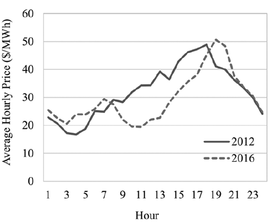

#< ignore

```{r setup}
library(RTutor)
# Adapt the working directory below and then run setup chunk in RStudio.
setwd("D:/Benutzer/Dokumente/Dokumente/Studium/03_Semester/Masterarbeit/0_Mein_Problemset/0_Problemset/1_Versuch")
ps.name = "Impact_of_renewables_on_conventional_generation"; sol.file = paste0(ps.name,"_sol.Rmd")
libs = c("ggplot2", "haven", "dplyr", "sandwich", "AER", "stats") # character vector of all packages you load in the problem set

#name.rmd.chunks(sol.file)
create.ps(sol.file=sol.file, ps.name=ps.name, libs=libs, addons = "quiz")
          
# The following line directly shows the problem set 
# in the browser
show.ps(ps.name,launch.browser=TRUE, auto.save.code=FALSE,sample.solution=FALSE)
```
#>


# Impacts of Renewable Energy on Conventional Generation

Author: Thomas Reumiller

## Welcome everybody...
...to this interactive RTutor-problem set. The aim of this work, which is part of my master thesis at Ulm University, is to provide an entertaining and educational way to deepen the understanding of econometric analysis and to improve some useful R skills. The basis of the problem set is the paper **"Setting with the Sun: The Impacts of Renewable Energy on Conventional Generation"** written by James Bushnell and Kevin Novan which was published in 2021 by the journal of the *"Association of the Environmental and Resource Economists"*. The main focus of the paper is to explore the potential longer-run impacts of the rising amount of renewable energy sources. Thereby the authors of the paper set focus on California’s electricity market and the respond of hourly wholesale electricity prices to changing utility-scale solar capacity.

The published paper itself can be found under this URL:
https://www.journals.uchicago.edu/doi/abs/10.1086/713249

and the originally used data can be downloaded from here:
https://doi.org/10.7910/DVN/6XQZ3L

**Note:** Please open links in a new tab to prevent the loss of progress you may have made in the problem set so far.  To open a link in a new tab press on the right mousebutton and select "Open link in new tab".

The problem set will be published here:

-   `GitHub`:
    <https://github.com/ThomasReumiller/Impact-of-renewables-on-conventional-generation>
-   `ShinyApps`:
    <https://thomasreumiller.shinyapps.io/Impact-of-renewables-on-conventional-generation>


## Exercise Introduction

For some years now, more and more countries around the world have been adopting actions to slow down and hopefully one day stop man-made climate change. One of the most common measures is the planned reduction of greenhouse gases, primarily CO2 (Quelle). As the energy sector, along with the transport sector, is responsible for the largest emissions of climate-damaging gases (Quelle), the conversion of this sector is often a key focus. While it is comparatively difficult to replace fossil fuels in heat generation, this is relatively feasible in the production of electrical energy. To do so investments are increasingly being made in renewable energies and older fossil fuel power plants are being replaced.

As the renewable energy sources of hydropower and geothermal energy are often only available on a very regional basis and to a limited extent, the focus in the expansion of renewable energies is primarily on wind and solar power. The available capacity of these energy forms has experienced strong growth in many countries in recent years. However, these two popular forms of electrical energy generation in particular present specific problems. The amount of energy they produce is very volatile and spontaneous changes are possible. For example, solar power plants can only produce electricity when the sun is shining strongly enough. This means that no or significantly less power can be provided at night or on days with poor weather conditions. Wind power plants are also dependent on external influences, their power output is, for example, determined by the strength of the wind blowing.

Due to these restrictions and the fast growing capacity renewable energies have a very specific impact on the associated electricity markets. These effects, with a focus on the hourly wholesale electricity price and its influence on conventional power plants, are the subject of the paper by Bushnell and Novan.

## How to Work on the Problem Set

Since RTutor problem sets are meant to be interactive, there are several tasks and quizzes all around the problem set. These different tasks are organized as exercises, which can be solved in an arbitrary order. But I would recommend to follow the structure and thereby the red line through the paper in order to achieve the best experience. Within each exercises it is necessary to follow the order of the tasks.
There will be different types of tasks you will encounter:

* quizzes where you can check if you understood the theoretical background so far or you just guess the right answer;
* R code chunks which are already completed and you are only asked to press `check`;
* some code chunks have gaps where you are asked to complete the code by replacing `___` correctly;
* ultimately there are empty code chunks where you have to fill in own code to complete the task;

Some of this code related task types may sound challenging when you have no great experience in R but you can always ask for a `hint`. Therefore just press the corresponding button. If you get stuck completely or you lost your motivation in one task you are always able to get the correct solution by pressing `solution`. If you wrote some code and you want to execute it press `run`. But be aware, to correctly complete a task you have to verify the solution by clicking `check`.

Sometimes when you want to start working on a code chunk you have to press `edit` first.

From time to time you will get awards for completing tasks or exercises. These awards symbolize your progress in becoming an expert in econometrics and coding in R. Additionally they exist to motivate you to do further progress.

When you have finished a (sub-)exercise, click on `Go to next exercise...` to continue on the next page or you can navigate with the tabs on the top .

<br/>

## Exercise Table of Content

1.  Data Overview & Descriptive Analysis <br/>
1.1 Data Overview <br/>
1.2 Descriptive Analysis <br/>

2.  Regression Analysis <br/>
2.1 Empirical Strategy (OLS-Regression & Errors) <br/>
2.2 Real-Time Market Price Changes <br/>
2.3 Impacts on Emissions <br/>

3.  Counterfactual Analysis <br/>
3.1 Counterfactual Prices Solar <br/>
3.2 Counterfactual Profits Solar <br/>
3.3 Marginal Energy Value Solar <br/>
3.4 Counterfactual Wind <br/>

4.  Robustness checks

5.  Conclusion

6.  References

Appendix - Analysis of German data <br/>
A1. OLS Regression


## Exercise 1 -- Data Overview & Descriptive Analysis
Since it is usually not easy to understand economic theories without references or examples from reality, I do not want to spend a long time with a theoretical introduction, but rather start directly with an initial overview of the data. The essential theoretical concepts will then be added at the appropriate point and with illustrative examples.

At the beginning of any good data analysis, you should familiarize yourself with the (in our case given) raw data. It makes sense to ask yourself the following questions:

-Where does the data come from? </br>
-For what purpose and by whom was the data collected? </br>
-What time period was it recorded or what time period does it reflect? </br>
-What information does the data contain? </br>
-In what condition is the data available? </br>
-What difficulties or distortions could the data have? </br>

Especially if, as in our case, a data set is already available, it should first be critically scrutinized. This is because incorrect, manipulated or misunderstood data can lead to incorrect results or conclusions. 

Therefore, we will now have a look at the given data set together and create initial descriptive analyses to get a feel for the data.
In this chapter we will also make first steps in R .

### Structure

1.1  Data Overview
 
1.2 Descriptive Analysis


## Exercise 1.1 -- Data Overview

The given data set contains hourly observations of electricity market data in California. The main source of the data is therefore the California Independent System Operator (CAISO). This data is complemented by other  sources like the Energy Information Administration (EIA), the Continuous Emissions Monitoring Systems (CEMS) of the Environmental Protection Agency and the National Oceanic and Atmospheric Administration (NOAA).

Before we can start exploring the data set you need to load the provided data file. Since the original analysis is done in the programming language *stata*, the needed file has a `.dta` format. Due to the fact that this isn't a standard format for *R* files you need the command `read_dta()` from the library `haven` to read the file.

In this info box you can take a look on how to load data with the `read_dta()` command or you just learn it by doing.

#< info "How to load data with read_dta()."

To read `.dta` files with R you can use the `read_dta()` function of the package `haven`. To do so you need to **load the required `haven` package**. This is done with the function `library()`. The name of the package has to be passed to the function as parameter.

```{r "1.1.1", eval=FALSE}
library(haven)
```

When the package is loaded you need to **call the function `read_dta`** and pass the name and the path of the file to the command. If the file is located in the current working directory (as we assume here) you only have to pass the file name *file_name.dta*. Don't forget to use parentheses for the name.

```{r "1.1.2", eval=FALSE}
read_dta("file_name.dta")
```

To access the loaded data you need to store it in a variable. Therefore you have to **assign a variable** to the `read.dta()` command. For example if you want to name the variable `data_name` the corresponding code has to look like this:

```{r "1.1.3", eval=FALSE}
data_name = read_dta("file_name.dta")
```

Now you have read in the data set and stored it in the variable `data_name`. 

If you have troubles or you are just curious about some commands it's always helpful to read the corresponding documentations. For example the [read_dta() documentation](https://haven.tidyverse.org/reference/read_dta.html).

#>

**Task:** In order to use the `read_dta()` command  load the package `haven` using `library()`.

```{r "1.1.4"}

#< task
#use  the command library() combined with the correct parameter to load the haven package
#>
library("haven")

```


**Task:** Use `read_dta()` to read the file *Setting_Sun_dataset.dta* and save it in a variable called `dat`.

```{r "1.1.5}

#< task
#use read_dta() to load "Setting_Sun_dataset.dta" and save it in dat
#>
dat = read_dta("Setting_Sun_dataset.dta")

```
#< award "Beginner"
Congratulations, you successfully loaded your first data set!
#>

We now have the data set available in the variable `dat`. To get a first look on it you can use the command `head()` with our variable `dat` as parameter. This shows the first six rows of the data set.

**Task:** Use `head()` on `dat` to view the first six rows

```{r "1.1.6}

#< task
#use head() on dat 
#>
head(dat)

```

This is the first look we have on the data set. We see that there are 37 columns containing very different things. Before we take a closer look on the columns we want to get a feeling of how much different data points (rows) there are. Therefore we use the command `NROW()` on our variable  `dat` to get the number of rows.

**Task:** Use `NROW()` on `dat` to get the number of rows

```{r "1.1.7}

#< task
#use NROW() on dat 
#>
NROW(dat)

```

Wow! We have a lot of data points. Luckily we have such a great tool like R that helps us to work with this large quantity of data.

So now let us inspect the columns a little bit. To get only the names of the different columns we can use the command `colnames()` on our data set.

**Task:** Use `colnames()` on `dat` to get column names

```{r "1.1.8}

#< task
#use colnames() on dat 
#>
colnames(dat)

```

Great, now we see the names of the different columns. We can see that the first five columns give some sort of hourly time stamp of each observation. We have columns for `year`, `month`, `day` and `hour`. But the first column `julian` may be unfamiliar for some. Therefore I will explain it.

A Julian date is a continuous count of days since an specific origin date. This origin date can differ depending on the area of application or in our case the software used. Since we know that the original analysis is done in *stata* we need the origin of the Julian date which is used there.

Again take a look at the first six rows from above. Can you guess (or calculate) the right origin?

#< quiz "origin data of stata"
question: What is the right origin date used by *stata*?
sc:
- 01.01.1960*
- 01.01.2000
- 31.12.1899
- 24.11.-4714
- 01.01.1970
success: Great, your answer is correct!
failure: Try again.
#>

We can see that the Julian date gives every day a specific and unique number. If you want to learn more about Julian dates just read [the Wikipedia article.](https://haven.tidyverse.org/reference/read_dta.html)

To find out at which time we have the first and the last observation in the data set (which time span is covered) we use the Julian date combined with the command `range()`. This gives us the maximum and the minimum of the Julian dates.

As we know want to get the range of a specific column we need to adress only the wanted column. In base *R* we do this by using the `$` syntax. For example, if we want to get only the column `day` of the data frame saved in `dat` we enter `dat$hour`.

**Task:** Fill in the right argument using the data frame stored in `dat` and the `$` syntax to get the range of the column `julian`

```{r "1.1.9}

#< fill_in
#fill in the right argument 
range(___)
#>

range(dat$julian)
```

We now have the range for Julian but we do not know the corresponding dates. To get the dates just check the following code chunk.


**Task:** Just `check` the chunk to get the corresponding dates out of the julian dates.

```{r "1.1.10"}
#< task
range(as.Date(dat$julian, origin="1960-01-01"))
#>
```

Now we see that the observations range from 01.01.2013 to 31.05.2017. We can quickly confirm th correctness by calculate the number of observations that should be between these two dates and compare it with the number of rows. Every Julian date (every observed day) should have 24 hourly observations. 

Therefore:


\# = (20970-19359+1)*24 = 38688 &ne; NROW(dat) = 38683

Oh no! There seems to be something weird. We did not get the right number of observations. So let's have a look where the five missing ones are. To do so it is helpful to introduce a new package called `dplyr`.

If one wants to analyse a data set there is a very powerful package that brings a lot of helpful functions. This package is called `dplyr`. We now use this package to find the missing observations. Therefore please load the library `dplyr` the way you did it before with the `haven` package.

**Task:** Load the package `dplyr` using the command `library()` 
```{r "1.1.11"}
#< task
#use  the command library() combined with the correct parameter to load the dplyr package
#>
library("dplyr")
```

Superb, now we can use all functions provided by the package `dplyr`. If you want to learn more about the package and its functions please read [here](https://haven.tidyverse.org/reference/read_dta.html).

If you never worked with the `dplyr` package or with pipes ` %>% ` it might be helpful to read the following two info boxes on how to access rows or columns using `filter()` and `select()` and on how to write code using pipes `%>%`. 

#< info "How to access rows or columns using filter() and select()."
Some lines ahead we learned how to access columns using the `$` syntax. While this is base R that works everywhere and every time, but it can get a little bit messy if the code gets longer and more functions and commands are included. Also we can only access one column at a time by using this method. 

With the help of `select()` we can select a subset of columns of the original data frame. Therefore we need to pass to the command at first the name of our data frame and then the names of the columns we want to select.
For example, if we want to select the columns `day` and `hour` of the data set stored in `dat` we could write:
```{r "1.1.12", eval=FALSE}
# First argument has to be the data frame and the other arguments are the names of the columns to select.
select(dat,day,hour)
```

The data frame we get back from this command is equal to the data frame we would get if we would write:
```{r "1.1.13", eval=FALSE}
# Here the bind_cols command binds the two separate colums together and name the columns as given. 
bind_cols(day = dat$day,hour = dat$hour)
```

You see that the first method looks much cleaner and is easier to read. If you want to know more about `select()` please read [here](https://haven.tidyverse.org/reference/read_dta.html).  

Analogously if we want so select specific rows (observations) the `filter()` command is the most convenient way to do this. In this command we also need the name of the data frame as the first argument, however the second argument has to be a logical condition.Thereafter the command builds a subset of all observations  that satisfy the condition.
For example, if we want to keep all rows where the `hour` is equal to 12 or 24, the code would look like this:
```{r "1.1.14", eval=FALSE}
# Here the bind_cols command binds the two separate colums together and name the columns as given. 
filter(dat, hour == 12 | hour == 24)
```

If you want to know more about `filter()` please read [here](https://haven.tidyverse.org/reference/read_dta.html).
#>

#< info "How to write code using %>%."
As we now know now to access certain rows or columns we can have a look on how to use the ` %>% ` operator.
There we find out how strong the `dplyr` commands really are.

Pipes `%>%` are a very beautiful way to write more complex code in a way that is easy to read and understand. Normally R code which contain different commands have to be written in different lines with intermediate results or one has to read it from the inside to the outside. Both ways have different disadvantages. By using the first method more useless variables are stored in the working environment. By using the second method it is difficult to understand the code easily.

You now see three different examples of code who generate the same output:

The first example follows the approach to write out every line of code separately and store the intermediate result.

```{r "1.1.15", eval=FALSE}
dat_ex1 = filter(dat, year == 2016) #take the subset of data which follows the condition 'year == 2016'
dat_ex2 = select(dat_ex1, load)     #select the column 'load'
dat_ex3 = sum(dat_ex2)              #sum over all elements in load
round(dat_ex3)                      #round the sum to a full number and print the result

```

As you see the code is in general readable but it's not very efficient to write code like that.

The second approach is to write different commands together.

```{r "1.1.16", eval=FALSE}
round(sum(select(filter(dat, year == 2016),load)))  #round the sum of the selected column 'load' of the subset which follows the condition 'year == 2016' to a whole number and print the result
```

The command is now much smaller and easier to execute but commands like this one can get very confusing. Normally you would neither write code in the one nor the other extreme but the best alternative is to write the code with pipes.


```{r "1.1.17", eval=FALSE}
dat %>%                       #use the variable 'dat'
  filter(year == 2016) %>%    #take the subset of data which follows the condition 'year == 2016'
  select(load) %>%            #select the column 'load'
  sum() %>%                   #sum over all elements in load
  round()                     #round the sum to a full number and print the result
```

Here you can really read the function of the code from top to bottom. Especially when the code is complex and other people should understand what is going on, this is the method of choice. Remark that in this style the pipes pass the intermediate results directly to the next command. Functions that normally need data as first argument use this passed results and therefore need no further data input. For a better understanding compare the code with the first example.

If you want to know more about pipe operators `%>%` please read [here](https://haven.tidyverse.org/reference/read_dta.html).

**Pro tip**: You can easily write the pipe operator `%>%` with the shortcut `Strg+Caps+m`.
#>

We now want to check if every Julian date in our data frame `dat` is really covered by 24 hours. Therefore we use a chain of pipes to find out if it is the case. In the pipe we first want to select the column `julian` from `dat` then use the function `table()` which show each distinct value of in the column and the number of occurrences. After that we want to sort the result with `sort()` such that if some Julian data value occurs less gets on the top. Finally we want to show the top 10 rows using `head()` with the number of rows we want to see as argument.

```{r "1.1.18"}
#< fill_in
#fill in the missing code
___ %>% 
  select(___) %>% 
  table() %>% 
  sort() %>% 
  head(___)
#>

dat %>% 
  select(julian) %>% 
  table() %>% 
  sort() %>% 
  head(10)

```
#< award "Raiders of the Lost Rows"
Nice! We now know which observations are missing. 
#>

We see that five julian dates have each one observation missing. These are exactly the five rows that were missing in the previous calculation. Due to that we have in total 38983 rows and only five are missing we can ignore this missing values. Especially if we are aware that these are all night hours (hour == 2 and hour == 3), which are not as essential for our analysis as for example the morning or evening hours.

As we now have analyzed the first 5 columns of the data set which gave us the times tamp of the observations it is now time to take a look on the other columns. As they are all numbered values we can get a brief overview by just calling the function `summary()` on the whole data frame in `dat`.

**Task:** Just `check` the chunk to see a summary of all stored variables.
```{r "1.1.19"}
#< task
summary(dat)
#>
```

As you can see the `summary()` command gives us basic statistical information about each variable like the minimum, the maximum, the mean, the median and the first and the third quantile. While some of these are just informative but not essential to know there is also a row which displays the number of `NA` values. `NA` stands for **"not available"** and marks missing values in the data.

When working with data sets containing NA's one has carefully think about how to deal with them. If a variable has many NA's this can lead to higher uncertainties or in the worst case wrong solutions. Furthermore they can cause problems in the execution of *R* commands. 
As the original analysis is done in *stata* and the authors did not choose a special NA treatment we just omit observations with NA values in the used variables.

#< info "Description of the variables in the data set"

In this info box i will give you a short description of the variables (except the already explained time variables) you already saw in the summary above.

**load**
Source: CAISO <br/>
Hourly CAISO electricity demand, less distributed generation (MWh). 

**solar**
Source: CAISO <br/>
Hourly CAISO solar generation (MWh) (this, and all following generation are utility-scale)

**wind**
Source: CAISO <br/>
Hourly CAISO wind generation (MWh)

**renewables**
Source: CAISO <br/>
Hourly CAISO renewable generation (MWh)

**nuclear**
Source: CAISO <br/>
Hourly CAISO nuclear generation (MWh)

**large_hydro**
Source: CAISO <br/>
Hourly CAISO large hydroelectric generation (MWh)

**imports**
Source: CAISO <br/>
Hourly net-imports into CAISO (MWh)

**thermal**
Source: CAISO <br/>
Hourly CAISO thermal generation (MWh)

**daily_wind**
Source: CAISO <br/>
Aggregate daily CAISO wind generation (GWh)

**daily_solar**
Source: CAISO <br/>
Aggregate daily CAISO solar generation (GWh)

**daily_load**
Source: CAISO <br/>
Aggregate daily CAISO demand, less distributed generation (GWh

**wind_curtailed**
Source: CAISO <br/>
Daily CAISO wind curtailed (GWh) -- available 5/1/2014 to end of sample

**solar_curtailed**
Source: CAISO <br/>
Daily CAISO solar curtailed (GWh) -- available 5/1/2014 to end of sample

**wind_potential**
Source: CAISO <br/>
Daily CAISO wind plus curtailed wind (GWh)

**solar_potential**
Source: CAISO <br/>
Daily CAISO solar plus curtailed solar (GWh)

**spot**
Source: EIA <br/>
Daily Henry Hub natural gas spot price ($/Mmbtu)

**inches_lag**
Source: NOAA <br/>
Monthly average California-wide precipitation over preceding 12 months


CAISO reports four different prices for different price zones. The company calls this zones "default load aggregation points" (DLAPs). Each of this DLAP prices consists of three different components. One component is the energy price itself, which is constant over all DLAPs and counts for 99% of the total price. The other two components namely the congestion component and the loss component are different for the DLAPs. Bushnell and Novan simply take the weighted mean of the different DLAPs to overall prices for the different components.    


**rtm_total_lmp**
Source: CAISO <br/>
Average hourly Real-Time Market price across DLAPs ($/MWh)

**rtm_congest_lmp**
Source: CAISO <br/>
Average hourly Congestion Component of Real-Time Market price across DLAPs ($/MWh)

**rtm_energy_lmp**
Source: CAISO <br/>
Average hourly Energy Component of Real-Time Market price across DLAPs ($/MWh)

**rtm_loss_lmp**
Source: CAISO <br/>
Average hourly Loss Component of Real-Time Market price across DLAPs ($/MWh)

**dam_total_lmp**
Source: CAISO <br/>
Average hourly Day-Ahead Market price across DLAPs ($/MWh)

**dam_congest_lmp**
Source: CAISO <br/>
Average hourly Congestion Component of Day-Ahead Market price across DLAPs ($/MWh)

**dam_energy_lmp**
Source: CAISO <br/>
Average hourly Energy Component of Day-Ahead Market price across DLAPs ($/MWh)

**dam_loss_lmp**
Source: CAISO <br/>
Average hourly Loss Component of Day-Ahead Market price across DLAPs ($/MWh)

**net_load_ccgt_caiso**
Source: CEMS <br/>
Hourly net generation from CAISO combined cycle gas turbines (MWh)

**net_load_gt_caiso**
Source: CEMS <br/>
Hourly net generation from CAISO gas turbines (MWh)

**net_load_st_caiso**
Source: CEMS <br/>
Hourly net generation from CAISO steam turbines (MWh)

**co2_caiso**
Source: CEMS <br/>
Hourly CO2 emissions from CAISO units (tons)

**nox_caiso**
Source: CEMS <br/>
Hourly Nox emissions from CAISO units (lbs)

**wind_cap**
Source: CAISO <br/>
Installed CAISO utility-scale wind capacity (MW)

**solar_cap**
Source: CAISO <br/>
Installed CAISO utility-scale solar capacity (MW)
#>

Well, we now have an overview of the data which is available in the data set. We know the names and the descriptions of the variables, the time span which is covered and the source for the data. But until know we still have no good qualitative intuition what information is contained in the data. Therefore we now want to start plotting some easy figures which helps us to gain more understanding.


## Exercise 1.2 -- Descreptive Analysis

In this exercise we want to gain deeper understanding of the contained information as well as the framework conditions in which our later analysis will take place. Additionally you will learn to make your first plots using the fabulous package `ggplot2`. 

To make the exercises really independent from each other it is necessary to load the data set and possibly needed variables at the beginning of each exercise. To do so please just check the following code chunk.

**Task:** Check the chunk to again load the data set and save it in `dat`.
```{r "1.2.1"}
#< task
dat = read_dta("Setting_Sun_dataset.dta")
#>
```

One of the three key features which differentiates the analysis made in the paper and in this problem set compared to other similar empirical studies is that it is not the goal to observe and analyse effects caused by short time fluctuations in solar production but to explicitly focus on long time variations. Other studies normally correct for these long time effects. This requirements fit perfectly for the CAISO electricity market as the renewable output, and particularly utility-scale solar, steadily increased as capacity grew. Additionally is the recorded growth in California particularly large.

The second key feature of the analysis in the paper is that the authors focus on how the price response differs across hours of the day and seasons compared to just an average change in the wholesale price.

The third difference is that it is not assumed that the wholesale price can only respond to the contemporaneous level of renewable output.

For comparison the authors also did their whole analysis for wind energy. We will follow this example and do some of our analysis also for wind energy.

We now want to take a look on this first key feature. Therefore we focus on the growth of utility-scale solar capacity in California. <br/>
Before we start doing the visualization we need to prepare our data a little bit, such that we can easily make good plots. First we want to get for each observation day the calendar date. To do so we can use another powerful function from the `dplyr` package. This function is called `mutate()` and adds columns to the data frame.

#< info "Create, modify and delete columns of a data frame using mutate()"
With the function `mutate()` of the package `dplyr` you can create, modify and delete columns. To do so you have to give the function in the first argument the data frame and in the others the name of the new respectively of the old column and the content. The new content can be a function of mathematical expressions combined with functions or other columns in the data set. Do not forget to save the result of the function in a new or if you want to override the old data set in the old variable. 
```{r "1.2.2", eval=FALSE}
# First argument has to be the data frame and the other arguments are the new or the modified columns.
dat_new = mutate(dat, solar_wind = solar + wind)
```

You can also mutate more than one column at a time.

```{r "1.2.3", eval=FALSE}
dat_new = mutate(dat,
                 solar_wind = solar + wind,   #creates a new column "solar_wind" which contains the sum of the column "solar" and the column "wind"
                 renewables = renewables - solar - wind   #modifies the column "renewables" such that only the renewables without solar and wind are measured
                 )
```

The corresponding code with base R using the `$` syntax would look like this:

```{r "1.2.4", eval=FALSE}
dat_new = dat
dat_new$solar_wind = dat_new$solar + dat_new$wind
dat_new$date = dat_new$renewables - dat_new$solar - dat_new$wind
```

Remark that `mutate()` only is one command and can be therefore much better fitted into a chain of piped commands.

If you want to learn more about the mutate command, please read [here](https://haven.tidyverse.org/reference/read_dta.html).
#>


**Task:** Transform every julian day number in `dat` to the right calendar date. Do this by adding a column named `date` which contains the corresponding transformation of the variable `julian`.
```{r "1.2.5"}
#< fill_in
#fill in the missing code
dat = mutate(___, ___ = as.Date(julian, origin="1960-01-01"))
#>

dat = mutate(dat, date = as.Date(julian, origin="1960-01-01"))
```

Great, we now have the correct dates for each observation day.

In the next step we want to build our first figures with the package `ggplot2`. <br/>

Therefore you first need to import the package `ggplot2` as you did it earlier with `haven` and `dplyr`.

**Task:** Load the package `ggplot2`.
```{r "1.2.6"}
#< task
#load the ggplot2 package
#>

library("ggplot2")
```

Perfect now we can use the toolbox provided by `ggplot2`. The basic function from this package is surprisingly called `ggplot()`. For more information on how to use this function please read the info box.

#< info "Creating graphics with ggplot()"

The whole `ggplot2` package works in a multi-layer principle. The basis of every plot made with ggplot is the ggplot object which is created with the command `gglpot()`. As an argument you can already give this function the data and the visual properties of objects in the plot (called aesthetics). After that you can add layers of so called `geoms` to draw the data on the blank ggplot object. This geoms can also hold arguments for data or aesthetics. If they do they override these in ggplot() for this layer. Finally you can add layers of properties or style elements.

```{r "1.2.7", eval=FALSE}
ggplot(dat, aes(x = date, y = solar_cap)) +   #crates a ggplot object and defines the aesthetics
  geom_line()+                                #adds a layer with a line plot
  geom_point(color = "red")                   #adds a layer with a point plot and sets the color of the points
  xlab("Date")+                               #labels the x-axis
  ylab("Solar Capacity")                      #labels the y-axis
```

This is just a very basic explanation and example of the whole range of possibilities offered by `ggplot2`, but it is enough for our usage here. If you want to know more, please read [here](https://haven.tidyverse.org/reference/read_dta.html).

#>

As our aim was to take a look on the growth of solar capacity it is now time to create the first figure which plots the days on the x-axis and the solar capacity on the y-axis.

**Task** Create a basic line plot using `ggplot()` combined with `geom_line()` which shows the variable `n_day` on the x-axis and `solar_cap` on the y-axis.

```{r "1.2.8"}
#< fill_in
#fill in the missing code to complete the task
ggplot(___, aes(x = ___, ___ = solar_cap)) +
  geom_line()+
  xlab("Date")+
  ylab("Solar Capacity")  
#>
ggplot(dat, aes(x = date, y = solar_cap)) +
  geom_line()+
  xlab("Date")+
  ylab("Solar Capacity")

```

#< award "A picture is worth a thousand words"
Probably everybody knows this adage. It unfolds its truth especially in data analysis.

If you want to know a little bit more about the adage, just read the Wikipedia article [here](https://en.wikipedia.org/wiki/A_picture_is_worth_a_thousand_words).
#>


We can see that the utility-scale solar capacity increased steadily and rapidly over the entire observation period. At the beginning of the period the capacity was at 1208 MW and in the end significantly higher at 10003 MW. So we can confirm the statement that California experienced a massive growth in utility-scale solar capacity.

Our next plot will focus on the daily solar production. To show you another cool aesthetic which is possible in `ggplot()` and to get a nicer graphic we first need to manipulate the data set again. 

This time we want to create a column named `season` which contains numbers from `1-4` to classify the observations into the different seasons. To do this you will need again the command `mutate()` and a new dplyr-command called `case_when()`.

#< info "Vectorise multiple if_else() statements with case_when()"

With the help of `case_when()` you can combine multiple `if_else()` statements in one elegant command. As an argument of the function you give logical statements (cases) which lead to a `TRUE` or `FALSE` answer. With a tilde operator you assign to each statement a return value. Each different case is evaluated sequentially and the first match for each element determines the  output. If no cases match, the .default is used. 

```{r "1.2.9", eval=FALSE}
#the example draws two uniformly distributed random integers between 0 and 5 and evaluates them with some statements written in a case_when() function.

x = round(runif(1,0,5))   #draw a random int between 0 and 5
y = round(runif(1,0,5))   #draw a random int between 0 and 5

case_when(
  x == y ~ "equal",
  x < y ~ "x smaller",
  (x > y) & ((x + y) %% 2 == 0) ~ "x grater and sum even",
  .default = "neither equal nor x smaller nor x grater and sum even"
)
```

If you want to know more, please read [here](https://dplyr.tidyverse.org/reference/case_when.html).
#>


**Task:** Add a new column called `season` to the data frame stored in `dat` using the function `mutate()`. </br>
The new column should contain: </br>
`1` if `month <= 2 | month >= 12`</br>
`2` if `month >= 3 & month <= 5`</br>
`3` if `month >= 6 & month <= 8`</br>
`4` if `month >= 9 & month <= 11`</br>

Use in the definition for the new variable season the command `case_when()`.
Save the new data frame again in `dat`. 

```{r "1.2.10"}
#< task
#classify the observations into seasons using mutate() and in the definition for the new variable season the command case_when().
#Tip: you do not need to define a default.
#>

dat = mutate(dat, season = case_when(
     month <= 2 | month >= 12 ~ 1,    
     month >= 3 & month <= 5 ~ 2,
     month >= 6 & month <= 8 ~ 3,
     month >= 9 & month <= 11 ~ 4))
```

After the season of each observation is defined we can plot the `daily_solar` production of utility-scale solar. To label the season of the observations we add in the aesthetics the argument color which should be set to `season`.

**Task** Create a graphic that shows the `daily_solar` production over the time. Also label the `season` with the color argument in `aes()`.

```{r "1.2.11"}
#< fill_in
#fill in the missing code to complete the task
ggplot(dat, aes(x = date, y = ___, color = ___)) +
  geom_line()+
  xlab("Date")+
  ylab("Solar production")+
  scale_colour_gradientn(colors = c("blue", "green", "yellow", "brown"))

#>

ggplot(dat, aes(x = date, y = daily_solar, color = season)) +
  geom_line()+
  xlab("Date")+
  ylab("Solar production")+
  scale_colour_gradientn(colors = c("blue", "green", "yellow", "brown"))

```

In this figure we can perfectly see the production of utility-scale solar. If you are a little familiar with solar energy production you will recognize some sort of curve. We see the typical shape one would expect. In the winter months there is a grate drop in the production due to a poorer angle to the sun an worse weather conditions while in the summer months there is the highest production. This pattern can be recognized so easily because we colored the seasons differently. Also the trend to higher production due to the growth in capacity is clearly visible.

Probably you wondered why there is always the addition **utility-scale**, when talking about capacities or production. The reason is that CASIO (the source of our data) do not collect and publish data related to distributed energy production. That is also why in the variable description in the exercise earlier said "less distributed generation" for some variables. Therefore because of the poor accessibility to data of distributed energy production, the fact that this energy is normally not sold at the wholesale market and the fact that utility-scale production is meaningful enough, the authors focused only on this type of energy production. Although the quantity of the output from the distributed solar capacity is not measured we can see the impact of it.

To see this impact we now want make a plot which shows the average hourly load over 24 hours in 2013 compared to 2016.
First of all we need to prepare the data for this new task. Here you will learn two further important commands from the 
`dplyr` package. This commands often come together. The first command is `group_by()` and the second `summarise()`. If you are not familiar with this commands please read the info box.

#< info "Group tables with group_by() and summarise grouped variables with summarise()"
As the title of the info box already says with the function `group_by()` you can define grouping variables which groups your data frame. On grouped data frames you can perform useful commands. As arguments the command needs a data frame and grouping variables like in the example below.

```{r "1.2.12", eval=FALSE}
dat_grouped = group_by(dat, hour, year) #arguments are the data frame dat and the grouping variables hour and year 
```

After the `group_by()` command the appearance of the data frame has not changed. It still looks like the original one. Only it is no a grouped data frame.</br>
If you want to learn more about `group_by()`, please read [here](https://dplyr.tidyverse.org/reference/case_when.html).

One of the most used commands on grouped data sets is the function `summarise()`. This command creates a new data frame which summaries the variables of each group in a way that can be passed to the function as parameter. 

```{r "1.2.13", eval=FALSE}
dat_new = summarise(dat_grouped,load_sum = sum(load),  solar_wind = solar+wind) 
```

Probably you recognize a similarity with `mutate()`. The difference here is that a new data frame is created which contains the grouping variables and this data frame is mutated but the mutation is applied to each subgroup separately </br>
If you want to learn more about `summarise()`, please read [here](https://dplyr.tidyverse.org/reference/case_when.html).

As you could guess this two commands are again a great use case for the pipe operator ` %>% `.
```{r "1.2.14", eval=FALSE}
data_new = dat %>% 
  group_by(hour,year) %>% 
  summarise(load_sum = sum(load),  solar_wind = solar+wind)
```

#>

As we want to display average hourly load in different years we need to group the data frame in the different `hour` and `year` variables using `group_by`. After that we want to `summaries()` the average `load` using `mean()`. As we will need it later it is a good idea to also summaries the average `solar` and `wind` production such as the average price `rtm_total_lmp`.

**Task** Group the data frame stored in `dat` by `hour` and `year`. Then summaries the mean of `load`, `solar`, `rtm_total_lmp` and `wind` and save the solution in `dat_hour_avg`. Finally show the first six rows of the new variable.

```{r "1.2.15"}
#< fill_in
#fill in the missing code to complete the task

dat_hour_avg = ___ %>% 
  ___(hour,___) %>% 
  ___(load = ___(load), solar =  mean(solar), price = mean(rtm_total_lmp, na.rm = TRUE), wind = mean(wind))

head(___)

#>


dat_hour_avg = dat %>% 
  group_by(hour,year) %>% 
  summarise(load = mean(load),solar =  mean(solar),price = mean(rtm_total_lmp, na.rm = TRUE),wind = mean(wind))

head(dat_hour_avg)
```

The created data set has 120 rows. One row for each possible combination of hour and year (24*5 = 120). As you can see in the output there are the grouped variables `hour` and `year` as well as the in `summarise()` defined ones. These variables contain the average over the original entries with the specific hour and year. Important to mention is that it was important to add `na.rm = TRUE` in the `mean()` command of the price. This comes because the variable `rtm_total_lmp` contains some `NA` values. If we don not tell the `mean()` function how to deal with them (remove them in this case) we also get `NA` as solution and that is not helpful for our analysis.

Now let us create the plot which shows the average hourly load over 24 hours in 2013 compared to 2016.

**Task** Just check the chunk to generate the plot.
```{r "1.2.16"}
#< task
ggplot() +
  geom_line(data = filter(dat_hour_avg,year == 2016), aes(x = hour, y = load, color = "2016"))+
  geom_line(data = filter(dat_hour_avg,year == 2013), aes(x = hour, y = load, color = "2013"), linetype = "dashed")+
  ylim(15000,35000)+
  theme(legend.position = "bottom",
        legend.title = element_blank())
  
#>
```

One can detect that the hourly load from 2016 is compared to 2013 very similar. Only at the midday hours is a small drop in the load compared to 2013. Bushnell and Novan explain that this is due to the rise in distributed solar which is not part of the measured load from CAISO. Therefore the higher production of distributed solar leads to a lower consumption measured by CASIO which looks in the load profile like a drop with its maximum at at midday.

We can now also make plots like this for the average hourly solar and wind production.

**Task** Just check the chunk to generate the plot.
```{r "1.2.17"}
#< task
ggplot() +
  geom_line(data = filter(dat_hour_avg,year == 2016), aes(x = hour, y = solar, color = "2016"))+
  geom_line(data = filter(dat_hour_avg,year == 2013), aes(x = hour, y = solar, color = "2013"), linetype = "dashed")+
  theme(legend.position = "bottom",
        legend.title = element_blank())
  
ggplot() +
  geom_line(data = filter(dat_hour_avg,year == 2016), aes(x = hour, y = wind, color = "2016"))+
  geom_line(data = filter(dat_hour_avg,year == 2013), aes(x = hour, y = wind, color = "2013"), linetype = "dashed")+
  theme(legend.position = "bottom",
        legend.title = element_blank())
  
#>
```

The first of this two plots again show the significant rise in solar production. Additionally it underlines a key characteristic of solar power generation, namely that power is only generated during daylight hours. At the morning and the evening hours there is a sharp rise respectively a sharp drop in power production.

The second plot for the wind shows interestingly nearly a inverted curve compared to solar. More wind energy is produced during evening and night than during the day. That suggests that wind and solar power plants are complements. But also noticeable is that there was now great rise in wind production over the years.

Probably you are aware that we have not plotted the prices so far. Before we do i want to ask you what do you think how the prices have changed between 2012 (!) and 2016, especially in the morning and the evening hours?

#< quiz "initial evidence"
question: How do you think have the prices changed between 2012 (!) and 2016 around the morning and the evening hours?
sc:
- they raised in all hours
- they stayed nearly the same over all hours
- they raised in these hours but fell in the others*
- they fell in all hours
- they fell in these hours but raised in the others
success: Great, your answer is correct!
failure: Try again.
#>

#< info "Solution to the Quiz"
  

This is a original figure from the paper of Bushnell and Novan. In contrast to us they used the year 2012 as comparison period. Unfortunately the data of 2012 is for us not available and therefore we use 2013 as comparison.

You can see in the graphic that the prices fell during midday hours where we have seen higher solar production, stayed nearly the same during night and increased during the morning and evening hours.  
#>

Bushnell and Novan take this emerging pattern as initial evidence for there further analysis (the analysis we do later on too). But interestingly when we create the same plot but with 2013 data ...

**Task** Just check the chunk to generate the plot.
```{r "1.2.17"}
#< task
ggplot() +
  geom_line(data = filter(dat_hour_avg,year == 2016), aes(x = hour, y = price, color = "2016"))+
  geom_line(data = filter(dat_hour_avg,year == 2013), aes(x = hour, y = price, color = "2013"), linetype = "dashed")+
  theme(legend.position = "bottom",
        legend.title = element_blank())

#>
```

...we do **not** get the same pattern. There we see higher prices in nearly any hour except for a very short time at the evening where prices are nearly equal. Clearly the drop at the midday hours is very strong and prices in morning and evening hours are higher than in other hours in 2016 but we do not see the same results when we compare to 2013 and not to 2012. Also if we would use the other years available in our data set (2014 or 2015) we would not get a graph like Bushnell and Novan. We can only speculate why we can not reproduce their initial evidence. Probably there are yearly fluctuations in the price or something changed in the year 2013 that makes it impossible to achieve the same pattern. But it could also be that 2012 was a very lucky choice for the authors and we would neither see the same type of pattern in other years before 2012.

For the following we will ignore this unsatisfying outcome of our plot and pretend that Bushnell and Novan's initial evidence holds. But always be aware that it is important to keep a critical mindset and to question presented results. Because even publications in renowned journals or by renowned authors can contain errors and inconsistencies which should not adopted uncritically.

In the next exercise we want to focus on the regression analysis Bushnell and Novan make to analyze the effect they spotted in their initial evidence.


## Exercise 2 -- Regression Analysis

Now that we have a good overview and an initial understanding of the data set, let us move on to one of the two main methodologies used by Bushnell and Novan in the paper. This method, which is presented and applied in this section, is one of the standard methods used in empirical economic studies. The method i talk about is the **ordinary least squares regression (ols-regression)**. 

With help of this method we are able to determine the effect of an increase of daily solar or wind production on the wholesale prices. Furthermore we can find substitution patterns between renewables and other sources and investigate the impact of increased daily solar on emissions of CO2 and NOX. It also provides the basis of the more advanced predictive analysis we will do afterwards.

The first exercise of this chapter should introduce to you the methodological approach of the OLS-Regression in general and in our specific case. We also talk about standard errors and special variations of errors like the later used **Newy-West standard-error**.

The second exercise deals with the actual regression of solar and wind production on prices and their results. We also want to analyze substitution patterns and quantify the effect of more solar and wind production. To gain a better understanding we again create graphics out of the results.

The third exercise focus on the impact of more solar and wind production on the emission of CO2 and NOX. 

### Structure

2.1 Empirical Strategy (OLS-Regression & Errors)
 
2.2 Real-Time Market Price Changes

2.3 Impacts on Emissions

## Exercise 2.1 -- Empirical Strategy (OLS-Regression & Errors)


## Exercise 2.2 -- Real-Time Market Price Changes

## Exercise 2.3 -- Impacts on Emissions

